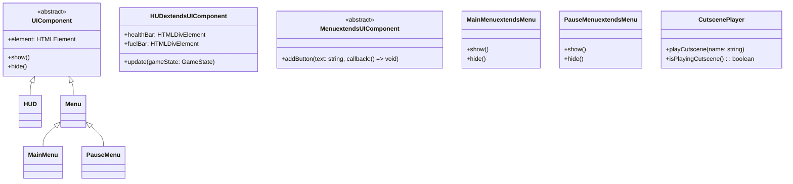

# ORBIT BREAKER - Architecture Diagram

## System Overview


## Data Flow


## Physics System Flow

```mermaid
flowchart TD
    subgraph Physics Update
        A[Update Physics] --> B[Apply Forces]
        B --> B1[Calculate Net Force]
        B1 --> B1a[Gravity Forces]
        B1 --> B1b[Custom Forces]
        B --> B2[Calculate Acceleration]
        B2 --> B2a[F = ma]
        A --> C[Update Positions]
        C --> C1[Update Velocity]
        C --> C2[Update Position]
        A --> D[Check Collisions]
        D --> D1[Collision Detection]
        D --> D2[Handle Collisions]
        D2 --> D2a[Entity.onCollision()]
    end
```

## Level Loading Process


## Entity Relationships


## Scene Management


## Save/Load System

```mermaid
flowchart TD
    A[Game State] --> B[currentLevel]
    A --> C[completedLevels]
    A --> D[playerStats]
    A --> E[gameSettings]
    A --> F[progression]

    subgraph Save Process
        G[Save Game] --> H[Serialize State]
        H --> I[JSON.stringify()]
        I --> J[localStorage.setItem()]
    end

    subgraph Load Process
        K[Load Game] --> L[localStorage.getItem()]
        L --> M[JSON.parse()]
        M --> N[Validate State]
        N --> O[Restore Game]
    end
```

## Performance Optimization


## Animation System


## UI Component Hierarchy



## Event System

```mermaid
flowchart TD
    A[EventBus] --> B[emit(event: string, data: any)]
    A --> C[on(event: string, callback: Function)]
    A --> D[off(event: string, callback: Function)]

    subgraph Common Events
        E[game_start]
        E --> F[SceneManager]

        G[level_complete]
        G --> H[LevelManager]

        I[player_death]
        I --> J[GameEngine]

        K[cutscene_start]
        K --> L[SceneManager]

        M[cutscene_end]
        M --> N[SceneManager]

        O[save_game]
        O --> P[SaveSystem]

        Q[load_game]
        Q --> R[SaveSystem]
    end
```

---

These diagrams provide a visual representation of the ORBIT BREAKER architecture, complementing the detailed technical specification. The modular design allows for easy extension and maintenance of the game systems.
