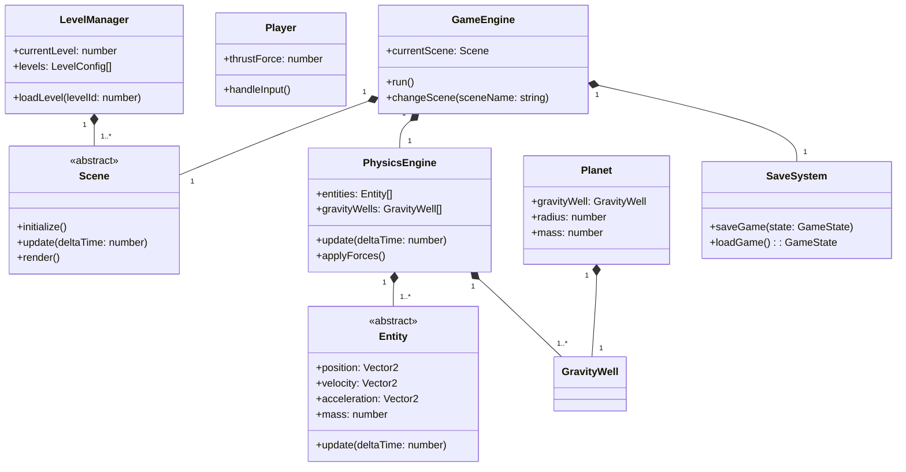
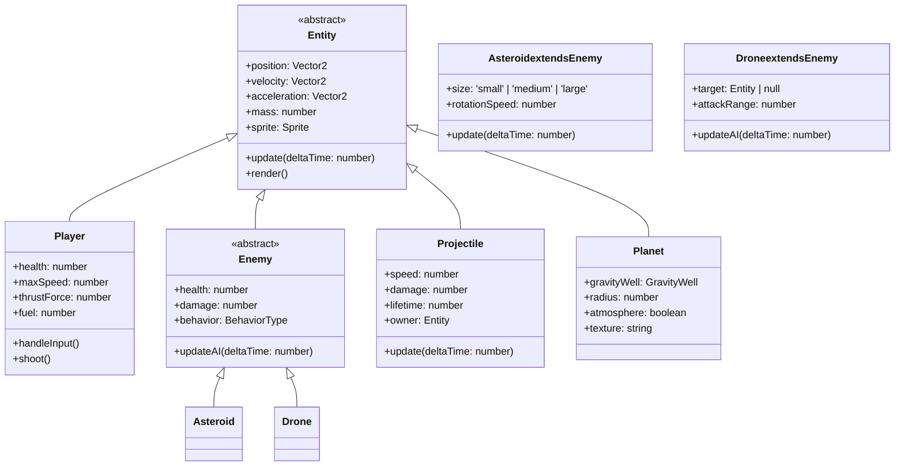

# ORBIT BREAKER - Technical Specification

## 1. Overview

ORBIT BREAKER is a physics-based space adventure game featuring force-based mechanics, planet-specific gravity, and data-driven level design. The game spans multiple environments including Earth, Sky, Space, Moon, and Mars with 100+ levels.

## 2. Game Architecture

### 2.1 Folder Structure

```
/orbit_breaker/
├── src/
│   ├── core/
│   │   ├── GameEngine.ts          # Main game loop and state management
│   │   ├── SceneManager.ts        # Scene transitions and loading
│   │   ├── EventBus.ts            # Global event system
│   │   └── Config.ts              # Game configuration
│   │
│   ├── physics/
│   │   ├── PhysicsEngine.ts      # Force-based physics core
│   │   ├── GravityWell.ts         # Planet-specific gravity implementation
│   │   ├── Force.ts               # Force types (thrust, gravity, drag)
│   │   └── CollisionDetector.ts   # Collision handling
│   │
│   ├── entities/
│   │   ├── Entity.ts              # Base entity class
│   │   ├── Player.ts              # Player ship with controls
│   │   ├── Enemy.ts               # Enemy types (asteroids, drones)
│   │   ├── Projectile.ts          # Bullets and missiles
│   │   ├── Planet.ts              # Planetary bodies
│   │   └── EnvironmentObject.ts   # Static and dynamic objects
│   │
│   ├── levels/
│   │   ├── LevelLoader.ts         # JSON level configuration loader
│   │   ├── LevelManager.ts        # Level progression and state
│   │   └── level_data/            # JSON level files (level_001.json, etc.)
│   │
│   ├── animation/
│   │   ├── AnimationController.ts # Sprite animation system
│   │   ├── SpriteSheet.ts         # Sprite sheet management
│   │   └── Animation.ts            # Animation definitions
│   │
│   ├── ui/
│   │   ├── HUD.ts                 # Heads-up display
│   │   ├── MenuSystem.ts          # Main menu and pause menu
│   │   ├── CutscenePlayer.ts      # Cutscene playback
│   │   └── components/            # Reusable UI components
│   │
│   ├── state/
│   │   ├── GameState.ts           # Current game state
│   │   ├── SaveSystem.ts          # localStorage save/load
│   │   └── SceneState.ts          # Scene-specific state
│   │
│   └── scenes/
│       ├── EarthScene.ts         # Earth environment
│       ├── SkyScene.ts           # Sky environment
│       ├── SpaceScene.ts          # Space environment
│       ├── MoonScene.ts           # Moon environment
│       └── MarsScene.ts           # Mars environment
│
├── assets/
│   ├── sprites/                  # Character and object sprites
│   ├── textures/                 # Backgrounds and environments
│   ├── audio/                    # Sound effects and music
│   └── levels/                   # Level-specific assets
│
├── config/
│   ├── game.json                # Game configuration
│   └── physics.json             # Physics constants
│
└── index.html                   # Main HTML file
```

### 2.2 Class Relationships



## 3. Physics System

### 3.1 Force-Based Physics Engine

The physics engine implements Newtonian physics with:
- **Position, Velocity, Acceleration** (PVA) model
- **Force accumulation** system
- **Planet-specific gravity** using inverse-square law
- **Drag forces** for atmospheric environments

```typescript
interface Vector2 {
    x: number;
    y: number;
}

class Force {
    constructor(
        public magnitude: number,
        public direction: Vector2,
        public type: 'thrust' | 'gravity' | 'drag' | 'impulse'
    ) {}
}

class PhysicsEngine {
    private entities: Entity[] = [];
    private gravityWells: GravityWell[] = [];
    private forces: Map<Entity, Force[]> = new Map();
    
    addEntity(entity: Entity): void {
        this.entities.push(entity);
    }
    
    addGravityWell(gravityWell: GravityWell): void {
        this.gravityWells.push(gravityWell);
    }
    
    addForce(entity: Entity, force: Force): void {
        if (!this.forces.has(entity)) {
            this.forces.set(entity, []);
        }
        this.forces.get(entity)!.push(force);
    }
    
    update(deltaTime: number): void {
        this.applyForces();
        this.updatePositions(deltaTime);
        this.clearForces();
    }
    
    private applyForces(): void {
        this.entities.forEach(entity => {
            const netForce = this.calculateNetForce(entity);
            const acceleration = this.calculateAcceleration(entity, netForce);
            entity.acceleration = acceleration;
        });
    }
    
    private calculateNetForce(entity: Entity): Vector2 {
        let netForce: Vector2 = { x: 0, y: 0 };
        
        // Apply gravity from all gravity wells
        this.gravityWells.forEach(gravityWell => {
            const gravityForce = gravityWell.calculateGravityForce(entity);
            netForce = this.addVectors(netForce, gravityForce);
        });
        
        // Apply custom forces
        if (this.forces.has(entity)) {
            this.forces.get(entity)!.forEach(force => {
                const forceVector = {
                    x: force.magnitude * force.direction.x,
                    y: force.magnitude * force.direction.y
                };
                netForce = this.addVectors(netForce, forceVector);
            });
        }
        
        return netForce;
    }
    
    private calculateAcceleration(entity: Entity, force: Vector2): Vector2 {
        return {
            x: force.x / entity.mass,
            y: force.y / entity.mass
        };
    }
    
    private updatePositions(deltaTime: number): void {
        this.entities.forEach(entity => {
            // Update velocity using acceleration
            entity.velocity.x += entity.acceleration.x * deltaTime;
            entity.velocity.y += entity.acceleration.y * deltaTime;
            
            // Update position using velocity
            entity.position.x += entity.velocity.x * deltaTime;
            entity.position.y += entity.velocity.y * deltaTime;
        });
    }
    
    private clearForces(): void {
        this.forces.clear();
    }
}
```

### 3.2 Planet-Specific Gravity

```typescript
class GravityWell {
    constructor(
        public position: Vector2,
        public mass: number,
        public radius: number,
        public gConstant: number = 6.67430e-11
    ) {}
    
    calculateGravityForce(entity: Entity): Vector2 {
        const distanceVector = {
            x: entity.position.x - this.position.x,
            y: entity.position.y - this.position.y
        };
        
        const distance = Math.sqrt(
            distanceVector.x * distanceVector.x +
            distanceVector.y * distanceVector.y
        );
        
        // Avoid division by zero
        if (distance < 0.1) return { x: 0, y: 0 };
        
        // Inverse-square law: F = G * (m1 * m2) / r^2
        const forceMagnitude = 
            (this.gConstant * this.mass * entity.mass) / (distance * distance);
        
        // Normalize direction vector
        const direction = {
            x: distanceVector.x / distance,
            y: distanceVector.y / distance
        };
        
        return {
            x: forceMagnitude * direction.x,
            y: forceMagnitude * direction.y
        };
    }
}

// Planet configurations
const PLANET_CONFIGS = {
    earth: {
        mass: 5.972e24,      // kg
        radius: 6.371e6,     // meters
        gConstant: 6.67430e-11
    },
    moon: {
        mass: 7.342e22,      // kg
        radius: 1.737e6,     // meters
        gConstant: 6.67430e-11
    },
    mars: {
        mass: 6.39e23,       // kg
        radius: 3.389e6,     // meters
        gConstant: 6.67430e-11
    }
};
```

## 4. Level Design System

### 4.1 Data-Driven Level Configuration

```typescript
interface LevelConfig {
    id: number;
    name: string;
    scene: 'earth' | 'sky' | 'space' | 'moon' | 'mars';
    gravityWells: GravityWellConfig[];
    entities: EntityConfig[];
    objectives: Objective[];
    background: string;
    music: string;
    ambientSounds: string[];
    difficulty: number;
    requiredUnlocks: number[];
}

interface GravityWellConfig {
    type: 'planet' | 'blackHole' | 'wormhole';
    position: { x: number; y: number };
    mass: number;
    radius: number;
    gConstant?: number;
    color?: string;
    texture?: string;
}

interface EntityConfig {
    type: 'player' | 'enemy' | 'projectile' | 'obstacle' | 'powerup';
    position: { x: number; y: number };
    properties: {
        [key: string]: any;
    };
}

interface Objective {
    type: 'reach' | 'destroy' | 'survive' | 'collect';
    target: string;
    description: string;
    successCondition: (gameState: GameState) => boolean;
}

class LevelLoader {
    async loadLevel(levelId: number): Promise<LevelConfig> {
        const response = await fetch(`/assets/levels/level_${levelId.toString().padStart(3, '0')}.json`);
        return response.json();
    }
    
    instantiateEntities(levelConfig: LevelConfig, physicsEngine: PhysicsEngine): Entity[] {
        const entities: Entity[] = [];
        
        levelConfig.entities.forEach(entityConfig => {
            switch (entityConfig.type) {
                case 'player':
                    const player = new Player(entityConfig.properties);
                    player.position = entityConfig.position;
                    entities.push(player);
                    break;
                case 'enemy':
                    const enemy = new Enemy(entityConfig.properties);
                    enemy.position = entityConfig.position;
                    entities.push(enemy);
                    break;
                // ... other entity types
            }
        });
        
        return entities;
    }
}
```

### 4.2 Sample Level JSON

```json
{
    "id": 1,
    "name": "Earth Orbit Initiation",
    "scene": "earth",
    "gravityWells": [
        {
            "type": "planet",
            "position": { "x": 0, "y": 0 },
            "mass": 5.972e24,
            "radius": 6.371e6,
            "color": "#1da1f2",
            "texture": "earth_texture.png"
        }
    ],
    "entities": [
        {
            "type": "player",
            "position": { "x": 1000, "y": 500 },
            "properties": {
                "health": 100,
                "maxSpeed": 500,
                "thrustForce": 1000,
                "sprite": "player_ship.png"
            }
        },
        {
            "type": "enemy",
            "position": { "x": 1500, "y": 300 },
            "properties": {
                "type": "asteroid",
                "size": "medium",
                "health": 50,
                "sprite": "asteroid_medium.png"
            }
        }
    ],
    "objectives": [
        {
            "type": "reach",
            "target": "orbit_point_1",
            "description": "Reach the first orbit checkpoint"
        }
    ],
    "background": "earth_background.png",
    "music": "earth_orbit.mp3",
    "ambientSounds": ["wind.mp3", "birds.mp3"],
    "difficulty": 1,
    "requiredUnlocks": []
}
```

## 5. State Management

### 5.1 Game State

```typescript
class GameState {
    currentLevel: number = 0;
    completedLevels: number[] = [];
    playerStats: {
        health: number;
        score: number;
        fuel: number;
        inventory: string[];
    };
    gameSettings: {
        soundVolume: number;
        musicVolume: number;
        controls: 'keyboard' | 'gamepad';
        graphicsQuality: 'low' | 'medium' | 'high';
    };
    progression: {
        unlockedScenes: string[];
        achievements: string[];
    };
    timestamp: number = Date.now();
}

class SaveSystem {
    private readonly SAVE_KEY = 'ORBIT_BREAKER_SAVE';
    
    saveGame(state: GameState): void {
        try {
            const saveData = JSON.stringify(state);
            localStorage.setItem(this.SAVE_KEY, saveData);
            return true;
        } catch (error) {
            console.error('Save failed:', error);
            return false;
        }
    }
    
    loadGame(): GameState | null {
        try {
            const saveData = localStorage.getItem(this.SAVE_KEY);
            if (saveData) {
                return JSON.parse(saveData);
            }
            return null;
        } catch (error) {
            console.error('Load failed:', error);
            return null;
        }
    }
    
    autoSave(state: GameState, interval: number = 300000): void {
        // Auto-save every 5 minutes
        setInterval(() => {
            this.saveGame(state);
        }, interval);
    }
}
```

### 5.2 Scene Management

```typescript
class SceneManager {
    private currentScene: Scene | null = null;
    private sceneMap: Map<string, Scene> = new Map();
    private physicsEngine: PhysicsEngine;
    private levelManager: LevelManager;
    
    constructor(physicsEngine: PhysicsEngine, levelManager: LevelManager) {
        this.physicsEngine = physicsEngine;
        this.levelManager = levelManager;
        this.initializeScenes();
    }
    
    private initializeScenes(): void {
        this.sceneMap.set('earth', new EarthScene(this.physicsEngine, this.levelManager));
        this.sceneMap.set('sky', new SkyScene(this.physicsEngine, this.levelManager));
        this.sceneMap.set('space', new SpaceScene(this.physicsEngine, this.levelManager));
        this.sceneMap.set('moon', new MoonScene(this.physicsEngine, this.levelManager));
        this.sceneMap.set('mars', new MarsScene(this.physicsEngine, this.levelManager));
    }
    
    async loadScene(sceneName: string, levelId: number): Promise<void> {
        if (!this.sceneMap.has(sceneName)) {
            throw new Error(`Scene ${sceneName} not found`);
        }
        
        // Clean up current scene
        if (this.currentScene) {
            this.currentScene.cleanup();
        }
        
        // Load level data
        const levelConfig = await this.levelManager.loadLevel(levelId);
        
        // Initialize scene with level data
        const scene = this.sceneMap.get(sceneName)!;
        scene.initialize(levelConfig);
        
        this.currentScene = scene;
    }
    
    update(deltaTime: number): void {
        if (this.currentScene) {
            this.currentScene.update(deltaTime);
        }
    }
    
    render(): void {
        if (this.currentScene) {
            this.currentScene.render();
        }
    }
}

abstract class Scene {
    protected physicsEngine: PhysicsEngine;
    protected levelManager: LevelManager;
    protected levelConfig: LevelConfig | null = null;
    
    constructor(physicsEngine: PhysicsEngine, levelManager: LevelManager) {
        this.physicsEngine = physicsEngine;
        this.levelManager = levelManager;
    }
    
    abstract initialize(levelConfig: LevelConfig): void;
    abstract update(deltaTime: number): void;
    abstract render(): void;
    abstract cleanup(): void;
}

class EarthScene extends Scene {
    private background: HTMLImageElement;
    
    initialize(levelConfig: LevelConfig): void {
        this.levelConfig = levelConfig;
        this.background = new Image();
        this.background.src = levelConfig.background;
        
        // Set up gravity wells
        levelConfig.gravityWells.forEach(gwConfig => {
            const gravityWell = new GravityWell(
                gwConfig.position,
                gwConfig.mass,
                gwConfig.radius,
                gwConfig.gConstant
            );
            this.physicsEngine.addGravityWell(gravityWell);
        });
        
        // Instantiate entities
        const entities = this.levelManager.instantiateEntities(levelConfig, this.physicsEngine);
        entities.forEach(entity => this.physicsEngine.addEntity(entity));
    }
    
    update(deltaTime: number): void {
        this.physicsEngine.update(deltaTime);
    }
    
    render(): void {
        // Render background
        // Render entities
    }
    
    cleanup(): void {
        // Remove all entities and gravity wells
        this.physicsEngine.clear();
    }
}
```

## 6. Entity Design

### 6.1 Entity Hierarchy



### 6.2 Entity Implementation

```typescript
abstract class Entity {
    position: Vector2 = { x: 0, y: 0 };
    velocity: Vector2 = { x: 0, y: 0 };
    acceleration: Vector2 = { x: 0, y: 0 };
    mass: number = 1;
    sprite: Sprite | null = null;
    isActive: boolean = true;
    
    constructor(properties: { [key: string]: any } = {}) {
        Object.assign(this, properties);
    }
    
    update(deltaTime: number): void {
        // Base update logic
        this.position.x += this.velocity.x * deltaTime;
        this.position.y += this.velocity.y * deltaTime;
    }
    
    render(context: CanvasRenderingContext2D): void {
        if (this.sprite) {
            this.sprite.render(context, this.position);
        }
    }
    
    applyForce(force: Force, physicsEngine: PhysicsEngine): void {
        physicsEngine.addForce(this, force);
    }
    
    abstract onCollision(other: Entity): void;
}

class Player extends Entity {
    health: number = 100;
    maxSpeed: number = 500;
    thrustForce: number = 1000;
    fuel: number = 100;
    
    constructor(properties: { [key: string]: any }) {
        super(properties);
        this.health = properties.health || 100;
        this.maxSpeed = properties.maxSpeed || 500;
        this.thrustForce = properties.thrustForce || 1000;
        this.fuel = properties.fuel || 100;
    }
    
    handleInput(keys: { [key: string]: boolean }): void {
        const thrustVector: Vector2 = { x: 0, y: 0 };
        
        // Forward thrust
        if (keys['ArrowUp'] && this.fuel > 0) {
            thrustVector.y = -this.thrustForce;
            this.fuel -= 0.5;
        }
        
        // Rotate left/right
        if (keys['ArrowLeft']) {
            // Rotation logic
        }
        
        if (keys['ArrowRight']) {
            // Rotation logic
        }
        
        // Apply thrust force
        if (thrustVector.x !== 0 || thrustVector.y !== 0) {
            const direction = this.normalizeVector(thrustVector);
            const force = new Force(this.thrustForce, direction, 'thrust');
            this.applyForce(force, GameEngine.instance.physicsEngine);
        }
    }
    
    shoot(): void {
        const projectile = new Projectile({
            position: { ...this.position },
            velocity: { ...this.velocity },
            speed: 800,
            damage: 20,
            lifetime: 3,
            owner: this
        });
        
        GameEngine.instance.physicsEngine.addEntity(projectile);
    }
    
    onCollision(other: Entity): void {
        if (other instanceof Enemy) {
            this.health -= other.damage;
            if (this.health <= 0) {
                this.isActive = false;
                EventBus.emit('player_death');
            }
        }
    }
    
    private normalizeVector(vector: Vector2): Vector2 {
        const magnitude = Math.sqrt(vector.x * vector.x + vector.y * vector.y);
        return {
            x: vector.x / magnitude,
            y: vector.y / magnitude
        };
    }
}

class Projectile extends Entity {
    speed: number = 800;
    damage: number = 20;
    lifetime: number = 3;
    owner: Entity;
    
    constructor(properties: { [key: string]: any }) {
        super(properties);
        this.speed = properties.speed || 800;
        this.damage = properties.damage || 20;
        this.lifetime = properties.lifetime || 3;
        this.owner = properties.owner;
    }
    
    update(deltaTime: number): void {
        super.update(deltaTime);
        this.lifetime -= deltaTime;
        
        if (this.lifetime <= 0) {
            this.isActive = false;
        }
    }
    
    onCollision(other: Entity): void {
        if (other !== this.owner && other instanceof Enemy) {
            other.health -= this.damage;
            this.isActive = false;
        }
    }
}
```

## 7. Animation System

### 7.1 Sprite-Based Animation

```typescript
class Sprite {
    image: HTMLImageElement;
    width: number;
    height: number;
    
    constructor(imageSrc: string, width: number, height: number) {
        this.image = new Image();
        this.image.src = imageSrc;
        this.width = width;
        this.height = height;
    }
    
    render(context: CanvasRenderingContext2D, position: Vector2, frame?: number): void {
        const frameWidth = this.width;
        const frameHeight = this.height;
        
        context.drawImage(
            this.image,
            frame * frameWidth, 0, frameWidth, frameHeight,
            position.x, position.y, frameWidth, frameHeight
        );
    }
}

class Animation {
    sprites: Sprite[];
    frameDuration: number;
    loop: boolean;
    currentFrame: number = 0;
    elapsedTime: number = 0;
    
    constructor(
        sprites: Sprite[],
        frameDuration: number = 0.1,
        loop: boolean = true
    ) {
        this.sprites = sprites;
        this.frameDuration = frameDuration;
        this.loop = loop;
    }
    
    update(deltaTime: number): void {
        this.elapsedTime += deltaTime;
        
        if (this.elapsedTime >= this.frameDuration) {
            this.elapsedTime = 0;
            this.currentFrame++;
            
            if (this.currentFrame >= this.sprites.length) {
                if (this.loop) {
                    this.currentFrame = 0;
                } else {
                    this.currentFrame = this.sprites.length - 1;
                }
            }
        }
    }
    
    render(context: CanvasRenderingContext2D, position: Vector2): void {
        this.sprites[this.currentFrame].render(context, position);
    }
}

class AnimationController {
    private animations: Map<string, Animation> = new Map();
    private currentAnimation: string | null = null;
    
    addAnimation(name: string, animation: Animation): void {
        this.animations.set(name, animation);
    }
    
    playAnimation(name: string): void {
        if (this.animations.has(name)) {
            this.currentAnimation = name;
        }
    }
    
    update(deltaTime: number): void {
        if (this.currentAnimation) {
            const animation = this.animations.get(this.currentAnimation)!;
            animation.update(deltaTime);
        }
    }
    
    render(context: CanvasRenderingContext2D, position: Vector2): void {
        if (this.currentAnimation) {
            const animation = this.animations.get(this.currentAnimation)!;
            animation.render(context, position);
        }
    }
}
```

### 7.2 Animation Configuration

```typescript
// Example: Player ship animations
const playerAnimations = {
    idle: new Animation(
        [
            new Sprite('player_idle_1.png', 64, 64),
            new Sprite('player_idle_2.png', 64, 64),
            new Sprite('player_idle_3.png', 64, 64)
        ],
        0.2
    ),
    thrusting: new Animation(
        [
            new Sprite('player_thrust_1.png', 64, 64),
            new Sprite('player_thrust_2.png', 64, 64),
            new Sprite('player_thrust_3.png', 64, 64)
        ],
        0.1
    ),
    exploding: new Animation(
        [
            new Sprite('explosion_1.png', 128, 128),
            new Sprite('explosion_2.png', 128, 128),
            new Sprite('explosion_3.png', 128, 128),
            new Sprite('explosion_4.png', 128, 128)
        ],
        0.1,
        false
    )
};
```

## 8. UI/UX System

### 8.1 HUD Components

```typescript
class HUD {
    private healthBar: HTMLDivElement;
    private fuelBar: HTMLDivElement;
    private scoreDisplay: HTMLDivElement;
    private levelDisplay: HTMLDivElement;
    private objectiveDisplay: HTMLDivElement;
    
    constructor() {
        this.initializeElements();
    }
    
    private initializeElements(): void {
        // Create HUD elements
        this.healthBar = document.createElement('div');
        this.healthBar.className = 'health-bar';
        
        this.fuelBar = document.createElement('div');
        this.fuelBar.className = 'fuel-bar';
        
        this.scoreDisplay = document.createElement('div');
        this.scoreDisplay.className = 'score-display';
        
        this.levelDisplay = document.createElement('div');
        this.levelDisplay.className = 'level-display';
        
        this.objectiveDisplay = document.createElement('div');
        this.objectiveDisplay.className = 'objective-display';
        
        // Add to DOM
        const hudContainer = document.createElement('div');
        hudContainer.className = 'hud-container';
        hudContainer.appendChild(this.healthBar);
        hudContainer.appendChild(this.fuelBar);
        hudContainer.appendChild(this.scoreDisplay);
        hudContainer.appendChild(this.levelDisplay);
        hudContainer.appendChild(this.objectiveDisplay);
        
        document.body.appendChild(hudContainer);
    }
    
    update(gameState: GameState): void {
        // Update health bar
        this.healthBar.style.width = `${gameState.playerStats.health}%`;
        
        // Update fuel bar
        this.fuelBar.style.width = `${gameState.playerStats.fuel}%`;
        
        // Update score
        this.scoreDisplay.textContent = `Score: ${gameState.playerStats.score}`;
        
        // Update level
        this.levelDisplay.textContent = `Level: ${gameState.currentLevel + 1}`;
        
        // Update objective
        if (gameState.currentLevel < gameState.completedLevels.length) {
            const levelConfig = LevelManager.instance.getLevelConfig(gameState.currentLevel);
            if (levelConfig && levelConfig.objectives.length > 0) {
                this.objectiveDisplay.textContent = 
                    `Objective: ${levelConfig.objectives[0].description}`;
            }
        }
    }
}
```

### 8.2 Menu System

```typescript
class MenuSystem {
    private menus: Map<string, Menu> = new Map();
    private currentMenu: string | null = null;
    
    constructor() {
        this.initializeMenus();
    }
    
    private initializeMenus(): void {
        this.menus.set('main', new MainMenu());
        this.menus.set('pause', new PauseMenu());
        this.menus.set('levelSelect', new LevelSelectMenu());
        this.menus.set('settings', new SettingsMenu());
        this.menus.set('gameOver', new GameOverMenu());
    }
    
    showMenu(menuName: string): void {
        if (this.currentMenu) {
            this.menus.get(this.currentMenu)!.hide();
        }
        
        this.currentMenu = menuName;
        this.menus.get(menuName)!.show();
    }
    
    hideCurrentMenu(): void {
        if (this.currentMenu) {
            this.menus.get(this.currentMenu)!.hide();
            this.currentMenu = null;
        }
    }
}

abstract class Menu {
    protected element: HTMLDivElement;
    
    constructor() {
        this.element = document.createElement('div');
        this.element.className = 'menu';
        this.element.style.display = 'none';
        document.body.appendChild(this.element);
    }
    
    abstract show(): void;
    abstract hide(): void;
    
    addButton(text: string, callback: () => void): HTMLButtonElement {
        const button = document.createElement('button');
        button.textContent = text;
        button.addEventListener('click', () => {
            callback();
            this.hide();
        });
        this.element.appendChild(button);
        return button;
    }
}

class MainMenu extends Menu {
    show(): void {
        this.element.innerHTML = '<h1>ORBIT BREAKER</h1>';
        this.addButton('Start Game', () => {
            EventBus.emit('start_game');
        });
        this.addButton('Level Select', () => {
            EventBus.emit('show_level_select');
        });
        this.addButton('Settings', () => {
            EventBus.emit('show_settings');
        });
        this.addButton('Quit', () => {
            // Quit game
        });
        this.element.style.display = 'block';
    }
    
    hide(): void {
        this.element.style.display = 'none';
    }
}

class PauseMenu extends Menu {
    show(): void {
        this.element.innerHTML = '<h1>PAUSED</h1>';
        this.addButton('Resume', () => {
            EventBus.emit('resume_game');
        });
        this.addButton('Restart Level', () => {
            EventBus.emit('restart_level');
        });
        this.addButton('Main Menu', () => {
            EventBus.emit('return_to_main_menu');
        });
        this.element.style.display = 'block';
    }
    
    hide(): void {
        this.element.style.display = 'none';
    }
}
```

### 8.3 Cutscene System

```typescript
class CutscenePlayer {
    private cutscenes: Map<string, Cutscene> = new Map();
    private currentCutscene: Cutscene | null = null;
    private isPlaying: boolean = false;
    
    constructor() {
        this.initializeCutscenes();
    }
    
    private initializeCutscenes(): void {
        // Load cutscenes from JSON or define programmatically
        this.cutscenes.set('intro', this.createIntroCutscene());
        this.cutscenes.set('earth_escape', this.createEarthEscapeCutscene());
        // ... other cutscenes
    }
    
    private createIntroCutscene(): Cutscene {
        return {
            scenes: [
                {
                    duration: 3,
                    background: 'black',
                    text: 'In the year 2150...',
                    audio: 'narrator_intro.mp3'
                },
                {
                    duration: 4,
                    background: 'earth_from_space.jpg',
                    text: 'Earth is dying...',
                    audio: 'narrator_earth_dying.mp3'
                },
                {
                    duration: 3,
                    background: 'spaceship_hangar.jpg',
                    text: 'The last hope...',
                    audio: 'narrator_last_hope.mp3'
                }
            ],
            skipable: true
        };
    }
    
    playCutscene(name: string): void {
        if (this.cutscenes.has(name)) {
            this.currentCutscene = this.cutscenes.get(name)!;
            this.isPlaying = true;
            EventBus.emit('cutscene_start');
            
            this.showCutscene();
        }
    }
    
    private showCutscene(): void {
        if (!this.currentCutscene) return;
        
        const cutscene = this.currentCutscene;
        let currentSceneIndex = 0;
        
        const showNextScene = () => {
            if (currentSceneIndex >= cutscene.scenes.length) {
                this.isPlaying = false;
                EventBus.emit('cutscene_end');
                return;
            }
            
            const scene = cutscene.scenes[currentSceneIndex];
            
            // Display scene
            document.body.innerHTML = `
                <div class="cutscene">
                    <div class="cutscene-background" style="background-image: url(${scene.background});"></div>
                    <div class="cutscene-text">${scene.text}</div>
                    ${cutscene.skipable ? '<button id="skip-cutscene">Skip</button>' : ''}
                </div>
            `;
            
            // Play audio
            if (scene.audio) {
                const audio = new Audio(scene.audio);
                audio.play();
            }
            
            // Schedule next scene
            setTimeout(() => {
                currentSceneIndex++;
                showNextScene();
            }, scene.duration * 1000);
            
            // Handle skip
            if (cutscene.skipable) {
                document.getElementById('skip-cutscene')!.addEventListener('click', () => {
                    this.isPlaying = false;
                    EventBus.emit('cutscene_end');
                });
            }
        };
        
        showNextScene();
    }
    
    isPlayingCutscene(): boolean {
        return this.isPlaying;
    }
}

interface Cutscene {
    scenes: CutsceneScene[];
    skipable: boolean;
}

interface CutsceneScene {
    duration: number; // in seconds
    background: string;
    text: string;
    audio?: string;
}
```

## 9. Performance Optimization

### 9.1 Optimization Strategies

1. **Entity Pooling**: Reuse entities instead of creating/destroying them
2. **Spatial Partitioning**: Quad-tree for collision detection
3. **Level Streaming**: Load only visible portions of levels
4. **Sprite Atlas**: Combine multiple sprites into single texture
5. **Object Culling**: Don't render off-screen entities
6. **Physics Optimization**: 
   - Use broader phase collision detection
   - Implement continuous collision detection
   - Reduce physics updates for distant objects
7. **Memory Management**: 
   - Garbage collection optimization
   - Texture atlas for sprites
   - Audio pooling
8. **Render Optimization**: 
   - WebGL for rendering
   - Batch rendering of similar entities
   - Level of Detail (LOD) for distant objects

```typescript
class EntityPool {
    private pools: Map<string, Entity[]> = new Map();
    
    getEntity(type: string, properties: { [key: string]: any }): Entity {
        if (this.pools.has(type) && this.pools.get(type)!.length > 0) {
            const entity = this.pools.get(type)!.pop()!;
            Object.assign(entity, properties);
            entity.isActive = true;
            return entity;
        }
        
        // Create new entity if pool is empty
        switch (type) {
            case 'projectile':
                return new Projectile(properties);
            case 'enemy':
                return new Enemy(properties);
            default:
                throw new Error(`Unknown entity type: ${type}`);
        }
    }
    
    returnEntity(entity: Entity): void {
        entity.isActive = false;
        const type = entity.constructor.name.toLowerCase();
        
        if (!this.pools.has(type)) {
            this.pools.set(type, []);
        }
        
        this.pools.get(type)!.push(entity);
    }
    
    clearPool(type: string): void {
        if (this.pools.has(type)) {
            this.pools.get(type)!.length = 0;
        }
    }
}

class QuadTree {
    private boundary: Rectangle;
    private capacity: number;
    private entities: Entity[];
    private divided: boolean;
    private northWest: QuadTree | null;
    private northEast: QuadTree | null;
    private southWest: QuadTree | null;
    private southEast: QuadTree | null;
    
    constructor(boundary: Rectangle, capacity: number = 4) {
        this.boundary = boundary;
        this.capacity = capacity;
        this.entities = [];
        this.divided = false;
    }
    
    insert(entity: Entity): void {
        if (!this.boundary.contains(entity.position)) {
            return;
        }
        
        if (this.entities.length < this.capacity) {
            this.entities.push(entity);
        } else {
            if (!this.divided) {
                this.subdivide();
            }
            
            this.northWest!.insert(entity);
            this.northEast!.insert(entity);
            this.southWest!.insert(entity);
            this.southEast!.insert(entity);
        }
    }
    
    query(range: Rectangle, found: Entity[]): Entity[] {
        if (!this.boundary.intersects(range)) {
            return found;
        }
        
        for (const entity of this.entities) {
            if (range.contains(entity.position)) {
                found.push(entity);
            }
        }
        
        if (this.divided) {
            this.northWest!.query(range, found);
            this.northEast!.query(range, found);
            this.southWest!.query(range, found);
            this.southEast!.query(range, found);
        }
        
        return found;
    }
    
    private subdivide(): void {
        const x = this.boundary.x;
        const y = this.boundary.y;
        const w = this.boundary.width / 2;
        const h = this.boundary.height / 2;
        
        this.northWest = new QuadTree(new Rectangle(x + w, y, w, h), this.capacity);
        this.northEast = new QuadTree(new Rectangle(x + w, y + h, w, h), this.capacity);
        this.southWest = new QuadTree(new Rectangle(x, y, w, h), this.capacity);
        this.southEast = new QuadTree(new Rectangle(x, y + h, w, h), this.capacity);
        this.divided = true;
        
        for (const entity of this.entities) {
            this.northWest!.insert(entity);
            this.northEast!.insert(entity);
            this.southWest!.insert(entity);
            this.southEast!.insert(entity);
        }
        
        this.entities.length = 0;
    }
}

interface Rectangle {
    x: number;
    y: number;
    width: number;
    height: number;
    
    contains(point: Vector2): boolean;
    intersects(other: Rectangle): boolean;
}
```

## 10. Implementation Guidelines

### 10.1 Development Workflow

1. **Setup**: Initialize project with TypeScript and Webpack
2. **Core Systems**: Implement GameEngine, PhysicsEngine, and SceneManager first
3. **Entity System**: Create base Entity class and extend for specific types
4. **Level Design**: Create JSON templates and LevelLoader
5. **Physics Testing**: Thoroughly test gravity and force calculations
6. **UI Integration**: Build HUD and menu system
7. **Save System**: Implement localStorage save/load
8. **Performance Testing**: Optimize with profiling tools
9. **Content Creation**: Design levels, sprites, and audio
10. **Polish**: Add animations, particle effects, and sound design

### 10.2 Testing Strategy

1. **Unit Tests**: Test individual components (PhysicsEngine, GravityWell)
2. **Integration Tests**: Test interactions between systems
3. **Physics Tests**: Verify force calculations and collisions
4. **Level Tests**: Ensure all 100+ levels load correctly
5. **Save/Load Tests**: Test game state persistence
6. **Performance Tests**: Measure FPS and memory usage
7. **Cross-Browser Testing**: Ensure compatibility across browsers

### 10.3 Deployment

1. **Build Process**: Webpack with TypeScript compilation
2. **Optimization**: Minify JS, compress images, optimize audio
3. **Hosting**: Static hosting on GitHub Pages, Netlify, or Vercel
4. **Progressive Enhancement**: Fallback for older browsers
5. **Analytics**: Track level completion rates and player behavior

## 11. Future Enhancements

1. **Multiplayer**: Cooperative and competitive modes
2. **Procedural Generation**: Procedurally generated levels
3. **Mod Support**: Community-created levels and mods
4. **VR Support**: Virtual reality mode
5. **Advanced Physics**: Relativistic effects for high speeds
6. **Planet Editor**: In-game level editor
7. **Achievements**: Steam achievement integration
8. **Cloud Saves**: Sync saves across devices

---

This technical specification provides a comprehensive foundation for developing ORBIT BREAKER. The modular architecture allows for easy extension and maintenance, while the data-driven design enables efficient level creation and management.