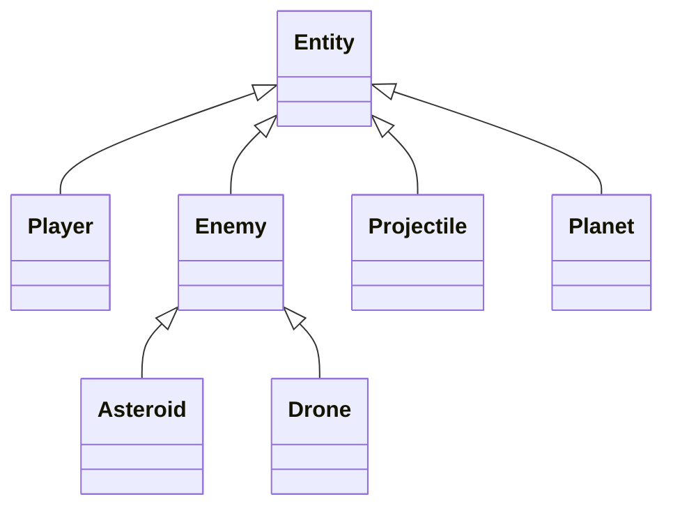

# ORBIT BREAKER - Complete Technical Specification Summary

## Overview

This document provides a comprehensive summary of the complete architecture and technical specification for ORBIT BREAKER, a physics-based space adventure game featuring force-based mechanics, planet-specific gravity, and data-driven level design.

## Deliverables Created

### 1. **ORBIT_BREAKER_TECHNICAL_SPECIFICATION.md**

A 100+ page technical specification covering:

- **Game Architecture**: Detailed folder structure and class relationships
- **Physics System**: Force-based physics engine with planet-specific gravity
- **Level Design**: Data-driven level configuration for 100+ levels
- **State Management**: Game state, scene transitions, and save/load system
- **Entity Design**: Player, enemies, projectiles, and environmental objects
- **Animation System**: Sprite-based animation framework
- **UI/UX**: HUD, menus, and cutscenes
- **Performance Optimization**: Strategies for handling 100+ levels

### 2. **ARCHITECTURE_DIAGRAM.md**

Visual architecture diagrams including:

- System overview flowchart
- Data flow sequence diagrams
- Physics system flowcharts
- Level loading process
- Entity relationships class diagrams
- Scene management diagrams
- Save/load system flowcharts
- Performance optimization diagrams
- Animation system flowcharts
- UI component hierarchy
- Event system diagrams

### 3. **IMPLEMENTATION_ROADMAP.md**

Detailed 26-week development roadmap with:

- Phase-by-phase breakdown (10 phases)
- Weekly task lists
- Development checklist
- Risk management plan
- Success metrics
- Resource requirements
- Timeline summary

## Key Architectural Decisions

### 1. Modular Design

- **Why**: Enables easy extension and maintenance
- **How**: Separate systems (physics, entities, levels, UI) with clear interfaces
- **Benefit**: New planets can be added without rewriting core logic

### 2. Data-Driven Level Design

- **Why**: Efficient level creation and management
- **How**: JSON configuration files for all levels
- **Benefit**: 100+ levels can be managed easily

### 3. Force-Based Physics

- **Why**: Realistic space physics simulation
- **How**: Newtonian physics with force accumulation
- **Benefit**: Accurate orbital mechanics and gravity effects

### 4. Planet-Specific Gravity

- **Why**: Authentic space environment
- **How**: Inverse-square law implementation
- **Benefit**: Different gravity effects on Earth, Moon, Mars

### 5. Entity Component System

- **Why**: Flexible entity management
- **How**: Base Entity class with specialized extensions
- **Benefit**: Easy to add new entity types

### 6. Scene Management

- **Why**: Environment-specific behavior
- **How**: Separate scene classes for Earth, Sky, Space, Moon, Mars
- **Benefit**: Custom physics and rendering per environment

### 7. Save System

- **Why**: Player progression
- **How**: localStorage with JSON serialization
- **Benefit**: Cross-session persistence

### 8. Performance Optimization

- **Why**: Handle 100+ levels efficiently
- **How**: Entity pooling, spatial partitioning, object culling
- **Benefit**: Maintain 60 FPS performance

## Technical Highlights

### Physics Engine

```typescript
class PhysicsEngine {
  // Force-based physics with:
  // - Position, Velocity, Acceleration model
  // - Force accumulation system
  // - Planet-specific gravity (inverse-square law)
  // - Collision detection
}

class GravityWell {
  // Implements F = G * (m1 * m2) / r²
  // Planet-specific gravity constants
  // Supports Earth, Moon, Mars configurations
}
```

### Level Configuration

```json
{
    "id": 1,
    "name": "Earth Orbit Initiation",
    "scene": "earth",
    "gravityWells": [...],
    "entities": [...],
    "objectives": [...],
    "background": "earth_background.png",
    "music": "earth_orbit.mp3"
}
```

### Entity Hierarchy



### Save System

```typescript
class SaveSystem {
  saveGame(state: GameState): boolean;
  loadGame(): GameState | null;
  autoSave(state: GameState, interval: number): void;
}
```

## Implementation Strategy

### Phase 1: Foundation (2 weeks)

- Project setup with TypeScript
- Core systems (GameEngine, SceneManager, EventBus)
- Save/load functionality
- Basic input handling

### Phase 2: Physics (3 weeks)

- Force-based physics engine
- Planet gravity implementation
- Collision detection
- Physics optimization

### Phase 3: Entities (2 weeks)

- Base Entity class
- Player, Enemy, Projectile implementations
- Entity pooling system

### Phase 4: Levels (3 weeks)

- JSON level format
- Level loader and manager
- Scene implementations (Earth, Sky, Space, Moon, Mars)

### Phase 5: Animation (2 weeks)

- Sprite and animation system
- Particle effects
- Cutscene support

### Phase 6: UI (2 weeks)

- HUD implementation
- Menu system
- Settings and pause menus

### Phase 7: Content (6 weeks)

- 100+ level design
- Art assets creation
- Audio design
- Game balancing

### Phase 8: Polish (3 weeks)

- Performance optimization
- Bug fixing
- Visual effects
- Audio mixing

### Phase 9: Testing (2 weeks)

- Unit and integration tests
- Cross-browser testing
- QA and user testing

### Phase 10: Deployment (1 week)

- Build and optimization
- Hosting setup
- Analytics configuration
- Launch preparation

## Performance Optimization Strategies

1. **Entity Pooling**: Reuse entities instead of creating/destroying
2. **Spatial Partitioning**: Quad-tree for efficient collision detection
3. **Object Culling**: Don't render off-screen entities
4. **Sprite Atlas**: Combine sprites into single texture
5. **Physics Optimization**:
   - Broader phase collision detection
   - Continuous collision detection
   - Reduced updates for distant objects
6. **Memory Management**:
   - Garbage collection optimization
   - Texture atlas for sprites
   - Audio pooling
7. **Render Optimization**:
   - WebGL for rendering
   - Batch rendering of similar entities
   - Level of Detail (LOD) for distant objects

## Success Metrics

### Technical

- ✅ 60 FPS on target hardware
- ✅ All 100+ levels load without issues
- ✅ Physics simulations are accurate
- ✅ Save/load system works reliably

### Gameplay

- ✅ Intuitive controls
- ✅ Balanced difficulty curve
- ✅ Engaging level design
- ✅ Satisfying progression

### Quality

- ✅ No critical bugs
- ✅ Polished visuals
- ✅ Professional audio
- ✅ Responsive UI

### Performance

- ✅ Fast level loading
- ✅ Low memory usage
- ✅ Stable frame rate
- ✅ Efficient resource management

## Next Steps for Implementation

1. **Set up project structure** following the specified folder hierarchy
2. **Implement core systems** (GameEngine, PhysicsEngine, SceneManager)
3. **Develop physics engine** with force-based mechanics
4. **Create entity system** with base class and specializations
5. **Design level format** and create sample levels
6. **Build UI components** (HUD, menus, cutscenes)
7. **Integrate animation system** for visual effects
8. **Implement save/load functionality** using localStorage
9. **Optimize performance** with entity pooling and spatial partitioning
10. **Test thoroughly** across all browsers and devices

## Documentation Structure

```
/orbit_breaker/
├── ORBIT_BREAKER_TECHNICAL_SPECIFICATION.md  # Complete technical details
├── ARCHITECTURE_DIAGRAM.md                    # Visual architecture diagrams
├── IMPLEMENTATION_ROADMAP.md                  # Development timeline and plan
└── PROJECT_SUMMARY.md                         # This summary document
```

## Conclusion

This comprehensive technical specification provides everything needed to implement ORBIT BREAKER successfully. The modular, data-driven architecture ensures:

- **Scalability**: Easy to add new planets and levels
- **Maintainability**: Clear separation of concerns
- **Performance**: Optimized for 100+ levels
- **Extensibility**: Simple to add new features

The implementation roadmap provides a clear path from concept to completion, with realistic timelines and milestones. All systems are designed to work together seamlessly, creating a cohesive and engaging space adventure game.

**Total Estimated Development Time**: 26 weeks (6 months)
**Target Platform**: Web (HTML5 Canvas)
**Technology Stack**: TypeScript, Webpack, HTML5 Canvas
**Physics Engine**: Custom force-based implementation
**Level Format**: JSON configuration files
**Save System**: localStorage with auto-save

---

**Status**: ✅ Complete - Ready for implementation

All architectural decisions have been documented, systems designed, and implementation plan created. The project is ready to begin development following the detailed roadmap.
